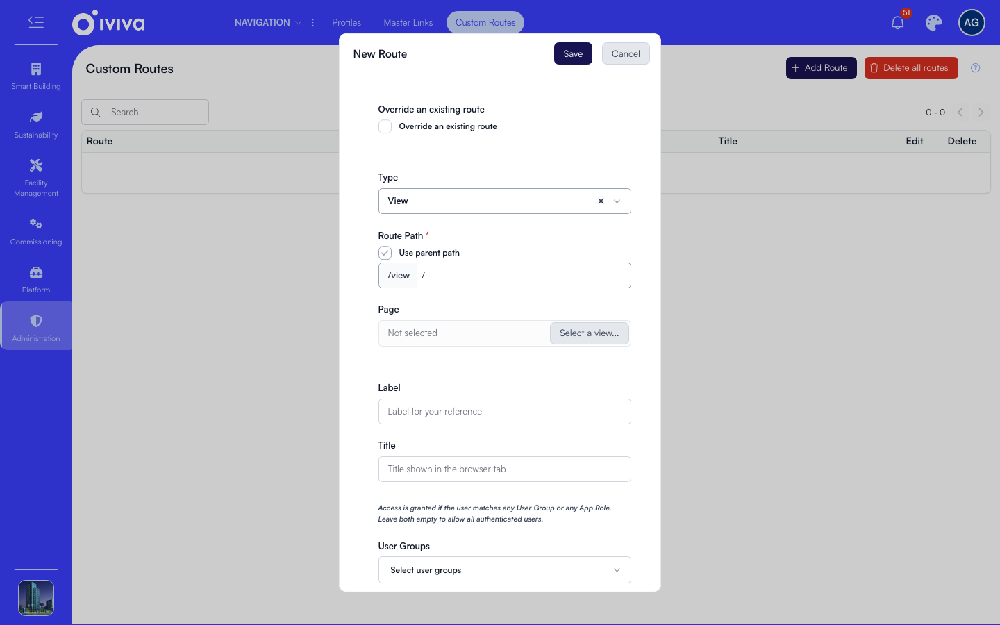

# Custom routes

A custom route maps a URL to a page without putting a link in the menu, and this page covers when to add one and how.

Open **Administration > Navigation > Custom Routes**.

## When to use one

Apps define built-in routes of their own for addresses that are not menu entries, such as detail pages. Custom routes work the same way, but you manage them here instead of waiting for a change to an app. Add one when you need:

- **A detail page address** that no app covers, for example `/view/assets/:id`, reached from a table or a widget rather than from the sidebar.
- **An override of an app's route**, to point an existing address at a different page or a redirect, without changing the app.
- **A landing address** you want to hand out, which simply redirects somewhere else.

If the address should also appear in the sidebar, add a master link with no page pointing at the same address. The link shows in the menu, and the custom route serves the page.

## Add a route

1. Click **Add Route**.
2. To take over an address an app already defines, tick **Override an existing route** and pick it from **Select Route to Override**. The label, title and page are filled in from that route, ready to change. Otherwise leave it clear and choose the **Type**: **View** for a page, or **Embedded Dashboard** for a dashboard canvas arranged in place.
3. Enter the **Route Path**, for example `/view/assets/:id`. A part written as `:id` is a placeholder: whatever the address carries there is handed to the page.
4. For a View route, choose the **Page** to render.
5. Fill in **Label** (for your own reference) and **Title** (shown in the browser tab), set **User Groups** and **App Roles** if the address should be limited, then click **Save**. *Access is granted if the user matches any User Group or any App Role. Leave both empty to allow all authenticated users.*

The path follows the same rules as a link address: it must start with `/view`, and `( ) [ ] { } + ! * ?` and a bare `:` are refused. A `?` is refused outright, with the message *A route is a path. Put query parameters on the navigation link that opens it.* Set those values in the **Query parameters** field of the link that opens the route, as described in [Links and link types](links.md).

## Which route wins

Three things can claim one address. They are applied in this order, and the last one wins:

1. A route an app defines.
2. A custom route you add here.
3. A navigation link that has a page or a destination.

So a custom route overrides an app's route, and a navigation link overrides both. If a custom route you saved does not seem to be used, a navigation link probably owns that address: remove the link's page, or point the link somewhere else, and the custom route takes over.

## Addresses you cannot claim

An address that belongs to a protected or locked navigation link, or to a route an app marks as system-managed, cannot be served by a custom route. Saving one is refused with *This URL is protected and cannot be served by a custom route*, and those routes are not offered in the override picker. In practice this covers the whole Administration area. The same applies to a navigation link you point at a protected address.

## Working with the list

Each row carries:

- **Open in new tab** to check what the address actually renders.
- **Configure page** to open that address with the page editor on it.
- The pencil to edit and the delete icon to remove a single route.

**Delete all routes** removes every custom route on the account after a confirmation. It cannot be undone, and any address that only a custom route served answers 404 afterwards, so export or note what you have before using it.

The list itself shows each route's **Route**, **Label**, **Title** and **Page ID**, so you can see at a glance which page an address renders.

## After a change

A saved route takes effect for users on their next page load, with no cache clearing needed. If an address still resolves the old way, check first whether a navigation link owns it, then reload the page with a hard refresh to rule out the browser's own cache.

## Checking your work

1. Use **Open in new tab** on the new row and confirm the right page renders.
2. Try the address as a user who is not in the groups or roles you set: it must answer Access denied, not the page.
3. If the address answers 404 instead, the route was not saved, or a different path was saved (a trailing slash or a typo in a `:parameter` is enough to miss).
