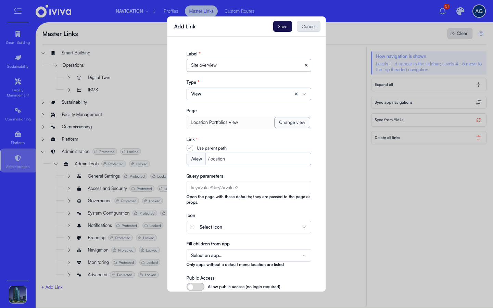
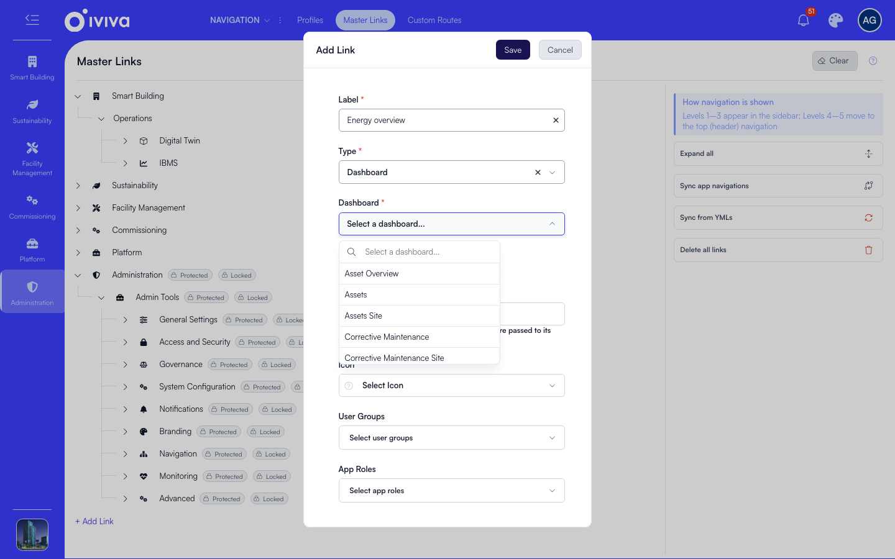
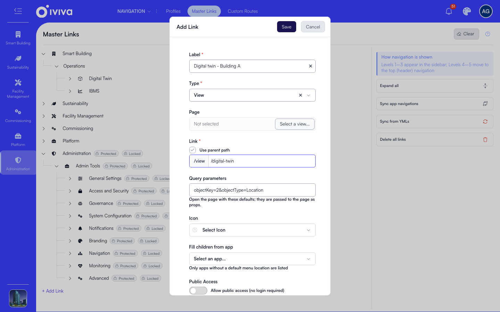

# Links and link types

Every entry in the sidebar is a link, and this page explains the link form field by field and what each type of link does when a user clicks it.

The same form opens from **Add Link**, from the **+** on a node, and from the pencil on a node.

To add a View link:

1. Choose the **Type**. A View link opens one of the pages the installed apps provide.
2. Enter the **Label** users see in the sidebar.
3. Set the **Link** address. With a parent selected, tick **Use parent path** to keep the parent's address as the prefix and type only the last part.
4. Pick the **Page** the link opens.
5. Click **Save**.

## The fields

| Field | What it does |
|---|---|
| **Label** | The text in the sidebar. Required. |
| **Type** | What kind of destination this link has. See the table below. |
| **Page** | The screen a View link opens. Pick it from the list of pages the installed apps provide. |
| **Dashboard** | For a Dashboard or Sub Dashboard link, the dashboard to open. The picker searches all dashboards on the account. |
| **Link** | The address of the link. With a parent selected, tick **Use parent path** to keep the parent's address as the prefix and type only the last part. |
| **Query parameters** | Defaults the link passes to the page. See below. |
| **Icon** | The icon in the sidebar. Levels 4 and 5 sit in the header row, which draws no icon, so the field is hidden there. |
| **Fill children from app** | Master Links only: hand this group's children to an app, refreshed on every sync. |
| **Public Access** | *Allow public access (no login required)*. Off by default. |
| **User Groups** | Limit the link to these groups. Empty means no limit of its own. |
| **App Roles** | Limit the link to users holding any of these roles. |

The parent is whatever node you clicked **+** on, or the node the link already sits under. To move a link to a different parent, drag it in the tree rather than editing the form.

## The link types

| Type | What you set | What clicking it does |
|---|---|---|
| **View** | A `/view/...` path and a **Page** | Opens that page at that address |
| **View, no page** | A `/view/...` path only | Follows whatever route already serves that address. Use it to put an app's detail page or a custom route in the menu |
| **Dashboard** | A dashboard from the picker | Opens the dashboard |
| **Sub Dashboard** | A dashboard and a section of it | Opens that section of the dashboard |
| **External Link** | A full web address | Opens that address |
| **Symlink** | Its own `/view/...` path plus a **Target Route**, and values for any `:parameters` in it | Shows the target's page at your own address |
| **Redirect** | Its own `/view/...` path plus **Redirect To** | Sends the user to the target address |
| **Embedded Dashboard** | A `/view/...` path | Opens a dashboard canvas of its own at that address, arranged in place |
| **Group / Label** | A label, and children under it | Opens the first child the user can see. With nothing visible under it, the group is hidden |
| **Dynamic** | A service or model action, with parameters and a base route | The app produces the children when the menu is built |

To point a link at a dashboard:

1. Set **Type** to **Dashboard**, or to **Sub Dashboard** for one section of a dashboard.
2. Pick the dashboard from the picker, which searches every dashboard on the account. The address is composed for you.

## Address rules

- A View, Symlink, Redirect or Embedded Dashboard address must start with `/view`, for example `/view/my-page`.
- A Sub Dashboard address must start with `/dashboard`, and is composed for you as `/dashboard/<dashboard>/<section>`.
- A symlink or redirect target may use either prefix.
- Only External Link accepts a full web address. Anywhere else the form asks for a path instead.
- An address may contain letters, numbers, `/`, `-`, `_` and `:parameters`, such as `/view/item/:id`. The characters `( ) [ ] { } + ! * ?` are refused, and a `:` must be followed by a parameter name.
- A `?` never goes in the address. Put those values in **Query parameters**.

## Query parameters

Query parameters let one link open a page with defaults already applied.

1. Set the **Link** address, for example `/view/digital-twin`.
2. Type the values in **Query parameters** as `key=value` pairs joined with `&`, for example `objectKey=2&objectType=Location`.

Clicking that link lands on `/view/digital-twin?objectKey=2&objectType=Location`, and Digital Twin opens on that building instead of the site view. The values reach the page exactly as if a user had typed them into the address bar.

The field is offered on View, Dashboard, Sub Dashboard, Symlink and Redirect links. On a symlink the parameters belong to your own address, and the target stays a plain path; on a redirect they are added to the target.

Points to know:

- The address, not the parameters, is what decides the route. Permissions, the page and **Configure Page** all behave exactly as they do on the plain address.
- The sidebar highlights the link whose parameters match the address the user is on, so a plain link and a parameterized link on the same page each light up on their own address.
- Values containing `?`, `#` or a space are refused, and so are the keys the product reserves for itself: `embedded`, `__embed__`, `configurepage`, `configuredashboard`, `pe_node`, `pe_mode`, `pe_tab`, `next` and `preview`.
- Adding parameters to a link that came from an app marks it **Modified**, so a normal sync keeps them and an override sync puts the app's link back.
- Two links on one address share a single route, so they should differ only in label, icon and parameters. Give them different pages or different permissions and the last of them in the tree silently decides for both, while **Configure Page** edits the first.

## Configure the page from a link

A node whose link opens a page carries a **Configure Page** action (**Configure Dashboard** for dashboards) that opens the destination with the page editor on it, so you can arrange the page without hunting for its address. Protected links have no such action: their pages are system-managed and the editor declines to open on them.
