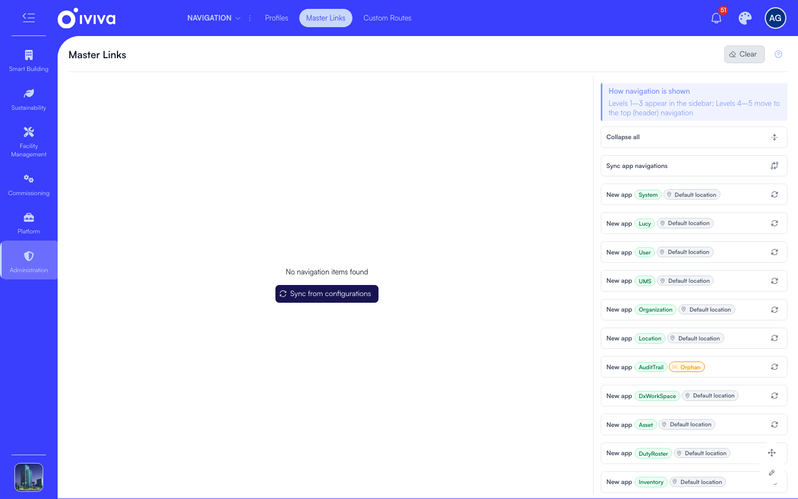
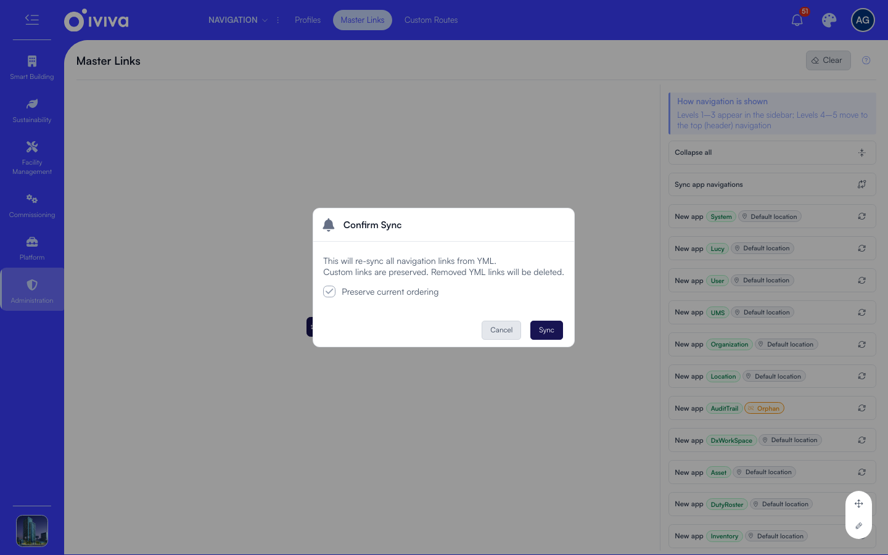
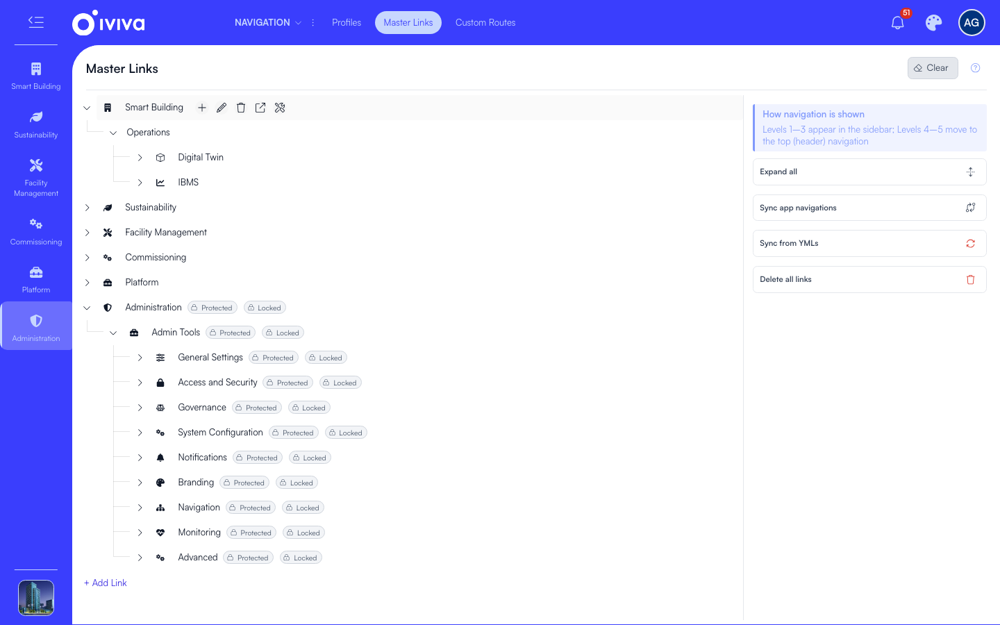
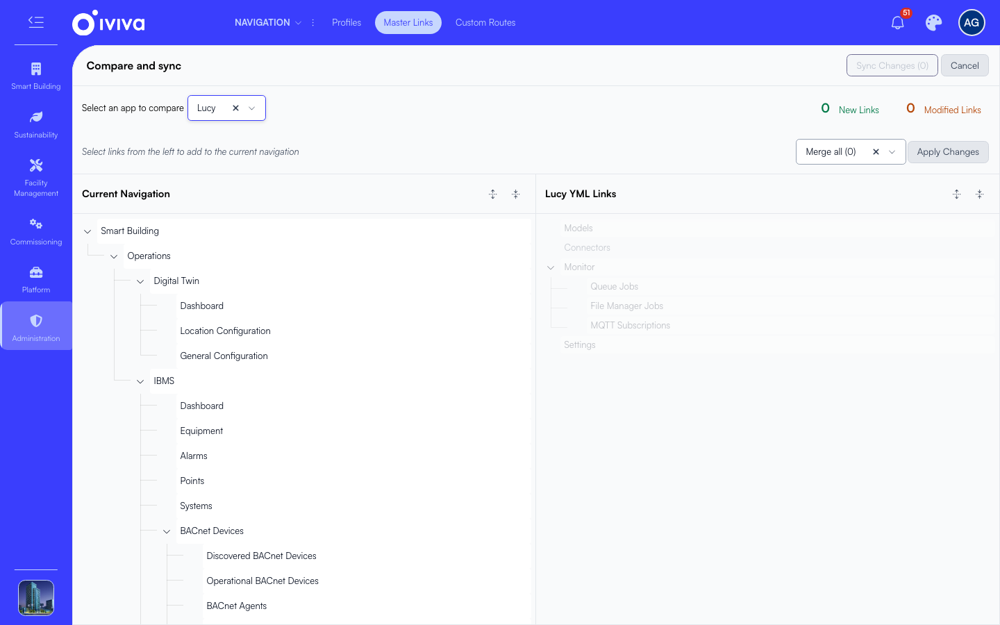

# Master links

Master Links is the single list of every navigation link on your account, and this page covers filling it from the apps and keeping it that way.

Open it at **Administration > Navigation > Master Links**. The tree fills the page, and the actions sit in the panel on the right.

## The first sync

A new account has an empty list, so the screen offers little more than the sync action. The right panel lists each enabled app as a **New app**, and the button that fills the list sits in the centre of the page. The right panel's **Sync from YMLs** action appears only once the list has links in it.

To fill the list:

1. Click **Sync from configurations** in the centre of the page.

The sync then asks twice. The first dialog is **Confirm Sync**.

1. Leave **Preserve current ordering** ticked.
2. Click **Sync**.

A second dialog, **Type To Confirm**, asks you to type `sync` before anything is written. The result then reads, for example, `Sync complete: 42 added, 0 updated, 0 deleted.`

The tree now holds every link the installed apps define, in their default order and grouping.

The actions used in the rest of this page:

- **Sync app navigations**, to compare and sync one app.
- **Sync from YMLs**, to sync every app again.
- **Delete all links**, to empty the list.
- The actions on a node: add a child, edit, delete, open the link, and configure its page.
- **Add Link**, to add a link at the top level.

## What a later sync does

Run **Sync from YMLs** in the right panel after installing or updating an app. It asks the same two dialogs, **Confirm Sync** and then **Type To Confirm**. Links are matched by their address, so the sync knows which link is which:

- Links the apps added are created.
- Links the apps changed are updated.
- Links you edited yourself are handled by your answer to the prompt below.
- Links you created yourself are never touched.
- Links an app no longer defines are deleted, and are removed from every profile that used them.

If anything in the list carries the **Modified** chip, the sync asks first: *$count Modified Link(s) Found*, with two choices.

- **Skip (preserve my changes)** keeps your edits. Afterwards a message names how many edited links kept their values.
- **Override with YML values** throws your edits away and puts the app's values back.

Untick **Preserve current ordering** only when you want the apps' default order back; your manual ordering is kept otherwise.

## Compare and sync one app

When a single app has changed, compare it before you sync. Click **Sync app navigations** in the right panel to open the compare view.

1. Choose the app from the picker at the top.
2. **Current Navigation** on the left is what your account has now.
3. **<app> YML Links** on the right is what the app defines. A summary above the two trees counts **New Links** and **Modified Links**.
4. Choose one of **Merge new**, **Merge modified** or **Merge all** in the dropdown.
5. Click **Apply Changes**.

You can also pick individual links in the right-hand tree and click **Sync Changes** instead. A link a custom link of yours already owns is reported as not applied, rather than overwritten.

The right panel also lists any app that is enabled but has no links in the list, as **New app** with the app's name. A **Default location** chip means a sync puts the app back in its usual place in the menu; an **Orphan** chip means the app has no default place, so decide where it belongs and either sync it and move it, or use *Fill children from app* on a group of your own.

## Add, edit and arrange links

- **Add a link** Click **Add Link** above the tree to add at the top level, or the **+** on a node to add a child of that node. The form is described in [Links and link types](links.md).
- **Edit a link** Click the pencil on the node. On a link that came from an app, saving adds the orange **Modified** chip: the link now holds your values, and a normal sync leaves it alone.
- **Reorder** Drag a node by its handle to a new position among its siblings. The order you set is what users see.
- **Move to another parent** Drag the node onto the group it should sit under. Everything below it moves with it.
- **Delete** Click the delete icon and confirm. The link and all of its children are deleted, and they are removed from every profile that listed them.

## Undo your edits

- To put one link back, click the **Revert to YML values** icon on a node carrying the Modified chip, and confirm.
- To put all of them back, click **Revert modified links** in the right panel (it appears only when there are modified links, and shows the count), confirm and type the word it asks for.

Both only work on links an app defines. A link you created has no app values to go back to.

## Fill a group with an app's links

A group you create can host another app's links instead of listing them by hand. Edit the group, set **Fill children from app**, and save. That app's links appear under it at once, carry a **Fills from &lt;app&gt;** chip, and refresh on every sync. Only apps with no default place in the menu are offered.

## Start over

**Delete all links** in the right panel empties the list completely, protected links included. It asks you to type a word to confirm, and it cannot be undone. Until your next sync, navigation and routes are served from the apps' files again, so users keep a working sidebar throughout.

The action is refused while any navigation profile exists, because the profiles would lose the links they point at. Delete the profiles first, or use **Sync from YMLs** instead.

## Chips on a node

| Chip | Meaning |
|---|---|
| **Public** | Open without a login |
| **Custom** | You created this link; no sync will touch it |
| **Modified** | An app's link you edited; a sync skips it unless you override |
| **Protected** | System-managed: it cannot be renamed, moved or deleted |
| **Locked** | System-managed access and position: its permissions and place cannot be changed |
| **Top Nav** | Sits at level 4 or 5, so it appears in the header row rather than the sidebar |
| **Fills from &lt;app&gt;** | The children come from that app and refresh on every sync |
| **Dynamic** | The children are produced at run time by the app |

## After a change

Saves take effect for users on their next page load. If something still looks stale, click **Clear** (the eraser icon) at the top of the screen to clear the cached navigation on all servers, then reload the page.
