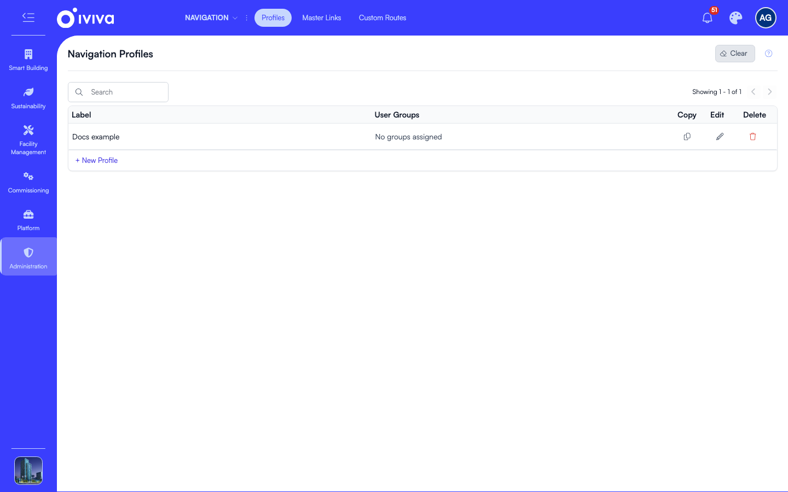
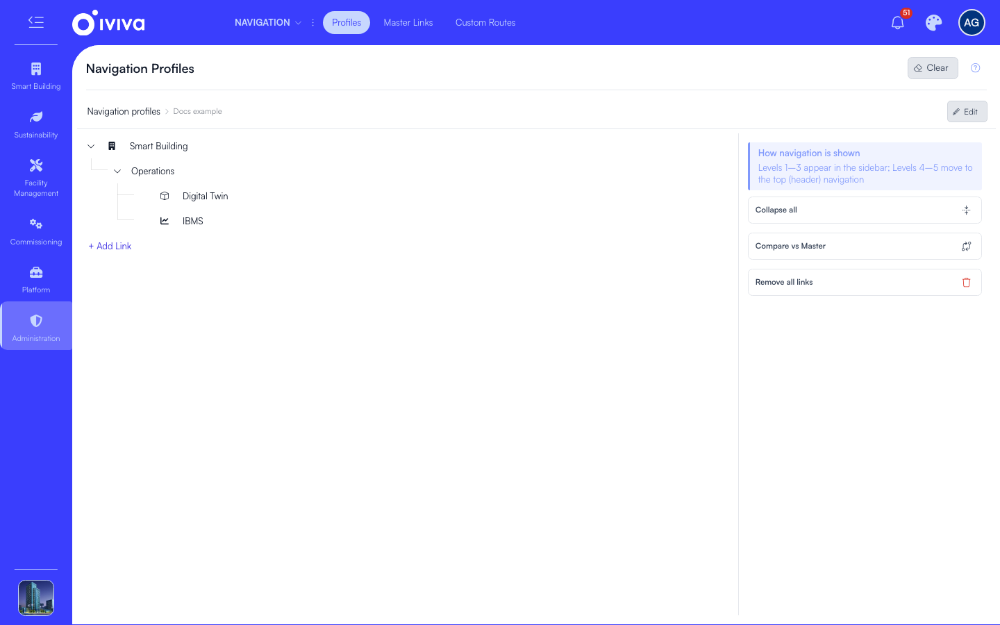

# Navigation profiles

A navigation profile gives one or more user groups their own selection, grouping and order of the master links, and this page covers creating profiles and arranging them.

Open **Administration > Navigation > Profiles**.

The list is where you work with profiles:

1. **+ New Profile** creates one.
2. Click a profile's label to open its tree.
3. The **User Groups** column shows which groups each profile serves, or *No groups assigned*.

## What a profile is, and what it is not

A profile arranges. It decides which of the master links a group sees in the sidebar, under which parents and in what order. It never grants access and never takes it away: a user can still open the address of any master link their permissions allow, even one the profile leaves out. To stop a user reaching a page, restrict the master link or the custom route that serves it, as described in [Who can see what](access.md).

A user group without a profile sees the full master tree.

## Create, copy and delete a profile

To create one, click **+ New Profile**, enter a **Label**, choose the **User Groups** this profile serves or leave them for later, and click **Create Profile**.

A new profile starts empty, so add links to it before assigning groups.

To copy a profile, click the copy icon on its row and give the copy a name. The copy holds the same links in the same hierarchy, with no user groups assigned.

To delete one, click the delete icon and confirm. Its link assignments go with it, and its user groups fall back to the full master tree.

## Assign user groups

A user group belongs to at most one profile, while one profile can serve many groups. Assign a group that already belongs to another profile, and it moves: the group leaves the other profile and joins this one. The list shows each profile's groups, or *No groups assigned*.

Users pick up the change on their next page load. Nothing logs them out.

## Arrange the profile

Click a profile's label to open its tree.

1. **Compare vs Master** in the right panel adds links from the master list. An empty profile offers the same thing as **Compare & Add from Master**.
2. **Remove all links** empties the profile without deleting it.
3. The tree is the profile's own hierarchy. Drag a node to a new position or onto a different parent; the master tree is untouched. Click the delete icon on a node and confirm to remove it, and its children, from this profile only. The master link and every other profile stay as they are.

The compare view puts **Profile Links** on the left and **All Master Links** on the right, with a **Filter by app** picker. Links already in the profile are marked **In Profile**. Use the add icon on a link to add it alone, or the subtree icon to add it with everything under it, then click **Sync Changes**. A link's ancestors come with it, so it lands under its master parent when that parent is already in the profile.

## Editing a link from inside a profile

The pencil on a profile node opens the master link, and says so: *Changes you make to this link apply to the master link and to every profile that uses it.* Label, icon, page and destination all change everywhere the link is used.

Access is not a profile setting. The form opened from a profile shows the link's public flag, user groups and app roles read only, with a note pointing you to Master Links, which is the only place to change them.

## What moves and what does not

- A link the profile moves to a new parent keeps the permissions of its place in the master tree, not of its new parent. Regrouping never widens or narrows access.
- A sidebar group the profile leaves out still answers its own address with Access denied rather than a 404, because the link still exists in the master list.
- Page settings configured on a master link, such as configured properties, reach profile users too.

## Keeping profiles in step

- Add a link to the master list and existing profiles do not get it automatically. Open the profile, click **Compare vs Master**, and add what is missing.
- Delete a master link and it disappears from every profile at once.
- A link deleted from the master list and brought back by a later sync is not put back into profiles. Add it again.
- Profile edits take effect for users on their next page load. If a change does not appear, click **Clear** (the eraser icon) at the top of the screen and reload.
