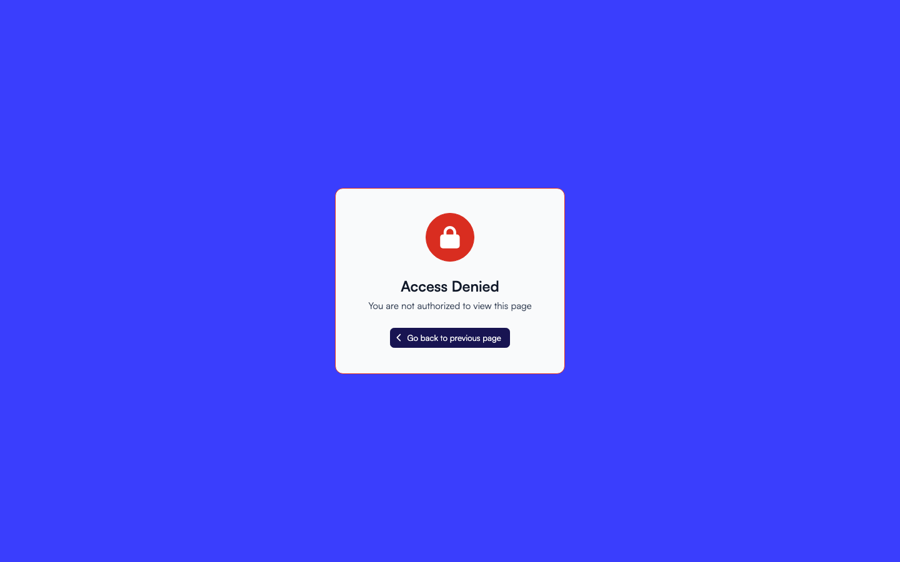

# Troubleshooting

This page lists the things that go wrong with navigation, what causes each one, and what to do about it.

## A link is missing for a user

**Cause** Something denies the user, or the link is not in their profile.

Check in this order:

1. Open the link in **Master Links** and read its **User Groups** and **App Roles**, then do the same for every section above it. Every level must pass.
2. Check whether the user's group has a profile, under **Navigation > Profiles**, and whether the link is in it. Add it with **Compare vs Master**.
3. If the link opens a page, the app may gate that page with roles of its own, which nothing in these screens overrides. Confirm by opening the address as that user: a page gated this way answers Access denied.
4. If the link is a section with no page of its own, it is hidden when every page under it is denied. Give the user access to at least one child.

See [Who can see what](access.md) for the full list of reasons.

## A user gets Access denied

**Cause** The address exists, but this user is not allowed to open it.

Work through the same four checks as above. Remember that a section's restrictions cover every page under it, so the denial often comes from a level well above the page.

## A user gets 404 (not found)

**Cause** Nothing is configured at that address.

- Check the address for a typo, including a missing or extra trailing part.
- If the link has no page of its own, something else has to serve its address: an app route or a custom route. Add a [custom route](custom-routes.md), or give the link a page.
- If you deleted a custom route, any address only it served answers 404 from then on.

## A change does not show up

**Cause** The navigation the user's browser holds is older than your change.

1. Click **Clear** (the eraser icon) at the top of Master Links or Profiles. This clears the cached navigation on all servers.
2. Reload the page with a hard refresh (`Ctrl`/`Cmd` + `Shift` + `R`).
3. Remember that users pick up navigation changes on their next page load, not instantly.

## "Unable to find the view"

**Cause** The address resolves, but the page it points at cannot be rendered.

Open the link in **Master Links** and confirm the **Page** field is set and still points at a page the installed apps provide. A page that came from an app that has since been removed shows this message.

Users holding the role for customizing pages and dashboards see a diagnostics block under the message naming the cause: no page configured, the app's scripts were not delivered, the page is not installed for this account, or the page failed to load. It also names what to check, and offers a **Manage Bundles** button where the page comes from an uploaded bundle. Everyone else sees only the friendly message.

A page that is merely slow does not show this: pages show a loading skeleton, and the error appears only after the page really fails to arrive.

## A sync did not change a link

**Cause** The link carries the **Modified** chip, so you edited it and the sync left it alone.

Either run **Sync from YMLs** again and answer **Override with YML values**, or click **Revert to YML values** on that node, or use **Revert modified links** in the right panel to reset all of them at once.

If a whole app is missing instead, look for a **New app** row in the right panel of Master Links and sync it from there.

## A link cannot be dragged, edited or deleted

**Cause** The link is protected or locked by the app that provides it, so it has no drag handle and no edit or delete action.

This is expected for the Administration area. Restrict who reaches those pages with user groups and app roles instead, or add your own links, which always sit after the system links in that section.

## A custom route will not save

**Cause** One of three rules refused it.

- *This URL is protected and cannot be served by a custom route.* The address belongs to a system-managed link or route. Choose a different address.
- *A route is a path. Put query parameters on the navigation link that opens it.* Remove the `?` from the path and set those values in the link's **Query parameters** field.
- A message about the path characters: use only letters, numbers, `/`, `-`, `_` and `:parameters`, starting with `/view`.

If the route saves but is not used, a navigation link with a page probably owns that address. Remove the link's page, or point the link elsewhere.

## Two links on one page behave oddly

**Cause** Two links share one address with different query parameters.

Links on one address share a single route, so they should differ only in label, icon and parameters. If they carry different pages or different permissions, the last of them in the tree decides for both.

## Resetting navigation from scratch

When the list is in a state you cannot unpick:

1. Delete every navigation profile, or the next step is refused.
2. In **Master Links**, click **Delete all links**, confirm and type the word it asks for. Protected links go too. Until you sync, navigation and routes come from the apps' files, so users keep a working sidebar.
3. Click **Sync from configurations** in the centre of the now empty page to build the list again from the apps' defaults, and answer the **Confirm Sync** and **Type To Confirm** dialogs.
4. Create the profiles again and assign their user groups. A group with no profile sees the full master tree in the meantime, so nobody is locked out while you rebuild.

Everything you had customized is gone after this, so use it only when a targeted revert is not enough. To undo edits without losing your custom links, use **Revert modified links** instead.
