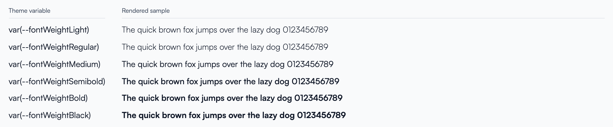

# Font Weights

> **Applies to:** every v5 app, widget and UI built on UXP. Prefer the theme's
> font-weight tokens over literal weights. Literal weights still render, but only
> tokens follow a platform font change automatically.

## Why tokens

UXP owns the platform font (currently Satoshi). Fonts don't all ship the same
weights, and the weight that "looks semibold" differs from one typeface to the
next. UXP tunes six named weights per font in the theme and exposes them as CSS
variables. When the font changes, UXP re-tunes the tokens — apps that use the
tokens pick the change up automatically; apps that hard-code `600` or `bold`
drift out of step with the rest of the platform.

Using the tokens is **highly recommended** for all new and migrated code.

## The tokens

| Token | Use it for |
|---|---|
| `--fontWeightLight` | De-emphasised text: captions, timestamps, helper text, field labels |
| `--fontWeightRegular` | Body text, table cells, descriptions — the default |
| `--fontWeightMedium` | Links, the active navigation item, small labels, toggles, secondary buttons |
| `--fontWeightSemibold` | Section titles, primary/submit buttons, selected items, collapsible headers |
| `--fontWeightBold` | Page and widget headings, table headers (`th`), names, notification titles |
| `--fontWeightBlack` | Display text: navigation group labels, error-page codes, hero numbers |

The actual numeric values are deliberately **not documented** — they are tuned
per font inside UXP (`defaultFontWeights` in `themeUtils.ts`) and may change.
Choose a token by *intent*, not by the number you think it maps to.

This is how they render with the current platform font (from the UXP showcase,
*Typography* item):



## How to use them

**SCSS / CSS**

```scss
.imyapp_card__title {
    font-weight: var(--fontWeightSemibold);
}

.imyapp_table th {
    font-weight: var(--fontWeightBold);
}
```

**Inline styles (React)**

```tsx
<span style={{ fontWeight: 'var(--fontWeightMedium)' }}>Active</span>
```

**Libraries that need a real number** — some libraries validate the weight
themselves (Monaco editor options, chart/canvas configs) and reject a `var()`
string. Read the resolved value from the theme in context instead:

```tsx
const context = useContext(UXPContext);

const editorOptions = useMemo(() => ({
    fontWeight: context.theme?.fontWeightMedium || 'normal',
}), [context.theme?.fontWeightMedium]);
```

## Migrating existing code

Replace each literal with the token that renders at that weight today:

| You wrote | Use |
|---|---|
| `100`, `200`, `lighter` | `var(--fontWeightLight)` |
| `300`, `normal` | `var(--fontWeightRegular)` |
| `400` | `var(--fontWeightMedium)` |
| `500` | `var(--fontWeightSemibold)` |
| `600` | `var(--fontWeightBold)` |
| `700`, `800`, `900`, `bold`, `bolder` | `var(--fontWeightBlack)` |

Exception: HTML that leaves the browser — email templates, PDF/report bodies —
has no access to CSS variables. Keep literal weights there.

## Lint

`uxp-lint` reports `scss-no-literal-font-weight` (warning) for any
`font-weight` that is not a `var(--fontWeight…)` token. See
[Lint & Scoped CSS](lint-and-scoped-css.md).

## Quick Tips

**DO:**
- ✅ Pick the token that matches the *role* of the text (heading, body, label…)
- ✅ Use `var(--fontWeight…)` in SCSS and inline styles alike
- ✅ Read `context.theme.fontWeight…` only for libraries that validate the value

**DON'T:**
- ❌ Hard-code numeric weights or `bold` / `normal` / `bolder` / `lighter` — they render, but won't follow a font change
- ❌ Assume a token equals a specific number — it is tuned per font
- ❌ Define your own `--font-weight-*` variables in an app
