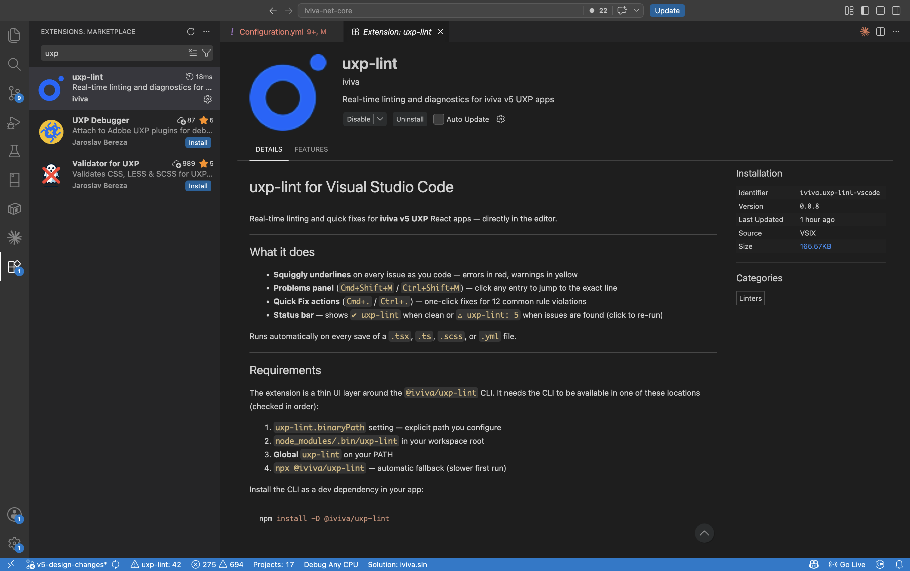
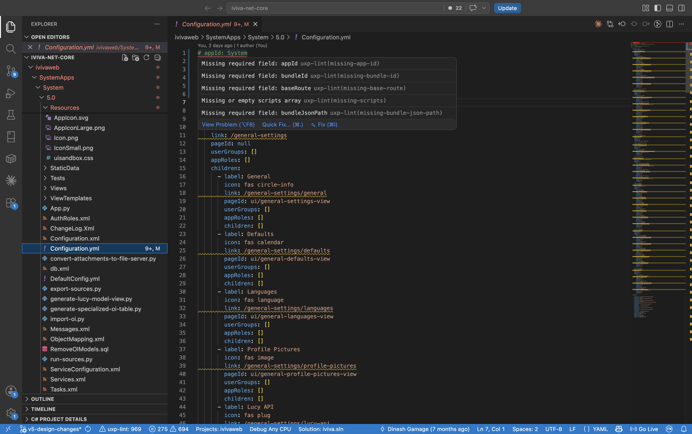
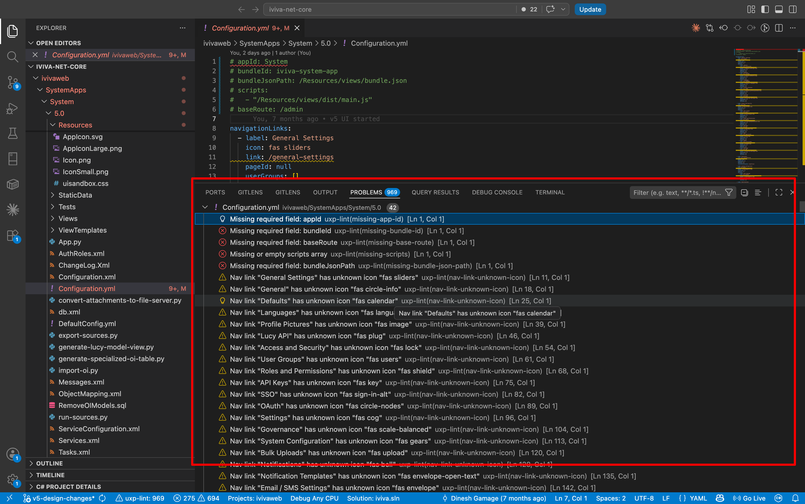
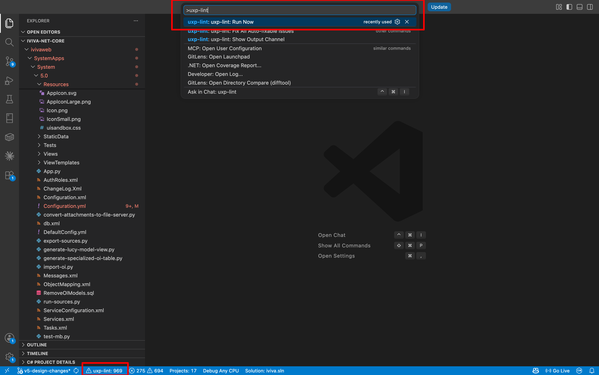

# Lint & Scoped CSS

> **Applies to:** v5 app projects — the `5.0` folder inside an iviva app
> (e.g. `ivivaweb/SystemApps/System/5.0`). Standalone widget projects created with
> `npx lucy-xp init` will get their own lint config in a future update.

Two tools ship with the v5 toolchain: **uxp-lint** catches code quality issues at development time, and **scoped CSS** eliminates style conflicts between widgets on a shared dashboard.

---

## uxp-lint

A static analysis tool that checks your widget code against v5 patterns before issues reach production.

**What it flags:**
- Inline styles (`style={{ color: 'red' }}`) — use SCSS classes instead
- Wrong icon format (`fal fa-bell` → should be `fal bell`)
- Form open/close state stored in React state — should use URL params
- Missing `React.memo` on components
- Malformed service config (missing `type`, `defaultValue`, `options`)
- Unknown icon names, incorrect event name format, and more

### In VSCode

Install the extension once and lint runs automatically — no manual steps needed.



Runs automatically on every save of a `.tsx`, `.ts`, `.scss`, or `.yml` file.

**Inline errors** — violations are underlined in red (errors) or yellow (warnings) directly in the editor. Hover over the underline to see the rule ID and a short description of what to fix.



**Quick Fix** — for common violations, press `Cmd+.` (Mac) or `Ctrl+.` (Windows) on the underlined code to apply a one-click fix.

**Problems panel** — all issues across the project collected in one place:

- Open with `Cmd+Shift+M` (Mac) or `Ctrl+Shift+M` (Windows), or go to **View → Problems**
- Each entry shows the file, line number, and rule ID — click any entry to jump straight to the code



**Manual trigger** — to re-run lint without saving a file:

- Open the Command Palette (`Cmd+Shift+P` / `Ctrl+Shift+P`), type **uxp-lint**, select **uxp-lint: Run Now**
- Or click the **uxp-lint** item in the status bar at the bottom of the window — shows `✔ uxp-lint` when clean, `⚠ uxp-lint: 5` when issues are found



---

## Scoped CSS

CSS class names are hashed at build time using the widget's bundle ID as a salt.

**Before:** `.container` in widget A and widget B are the same class — one overrides the other when both are open in a shared dashboard.

**After:** `.container` becomes `.container-a3f9b2c1` in widget A and `.container-d7e2f4b0` in widget B — completely isolated, no style bleed.

No changes needed in your code. Class names in JSX and SCSS stay as-is; hashing happens transparently at build time.

### Rules

Class names are hashed based on the file path. For TSX and SCSS to produce matching hashes, two conditions must hold:

**1. Same filename stem** — `Button.tsx` must pair with `Button.scss`

**2. Same directory** — both files must be in the same folder

```
src/components/Button/
  Button.tsx     ✓  hash: a3f9b2c1
  Button.scss    ✓  hash: a3f9b2c1  ← matches

src/components/Button/Button.tsx   ✓  hash: a3f9b2c1
src/styles/Button.scss             ✗  hash: d7e2f4b0  ← different path, won't match
```

### Global SCSS

A shared file like `global.scss` imported by multiple components gets the hash of `global.scss` itself, which won't match any TSX file. Exclude shared prefixes in `webpack.config.js` so those class names are left unscoped:

```js
scopedCssWebpack({
    salt: bundleJson.id,
    exclude: ['global-', 'shared-', 'uxp-']
})
```

Any class starting with an excluded prefix is left as-is in both JSX and CSS.

---

## Setup

### Existing v5 projects — one command (recommended)

Run from your app's `5.0` folder:

```bash
cd /path/to/YourApp/5.0
npx lucy-xp setup
```

This installs the VSCode extension, creates the lint config, patches `webpack.config.js` for scoped CSS, installs dependencies, and optionally runs a build to verify — all with a step-by-step progress display.

Prompts for:
- Path to your app's `5.0` folder (defaults to current directory)
- Path to `views` folder (defaults to `Resources/views`)

### Step by step

If you prefer to run each part separately:

**1. Install the uxp-lint VSCode extension**

```bash
npx lucy-xp install-lint-vscode
```

Reload VSCode after: `Cmd+Shift+P` → *Developer: Reload Window*

**2. Configure uxp-lint**

```bash
# from your app's 5.0 folder
npx lucy-xp setup-lint
```

Creates `.uxplint/config.json`, adds `lint` and `postbuild` scripts to `views/package.json`, adds `@iviva/uxp-lint` as a devDependency.

```bash
cd Resources/views && npm install
```

**3. Set up scoped CSS**

```bash
# from Resources/views
npx lucy-xp setup-scoped-css
```

Installs the required packages and patches `webpack.config.js`.

### New projects

After creating your widget with `npx lucy-xp init --env v5`, run setup from the app's `5.0` folder:

```bash
cd /path/to/YourApp/5.0
npx lucy-xp setup
```

---

## After setup

```bash
npm run build   # compiles — lint report shown after
npm run lint    # run lint manually at any time
```

Lint runs after every build but never blocks it. When the team is ready to enforce a quality gate:

```bash
# in views/package.json — change both postbuild and lint scripts to:
uxp-lint --ci
```

`--ci` mode exits with code 1 on any errors, which will fail a CI build.

---

## Next Steps

- [Styling](./styling.md) - Theme system, CSS variables, SCSS structure
- [Bundle Optimization](./bundle-optimization.md) - `uxp-lint optimise`: code-splitting & lazy loading to shrink the bundle
